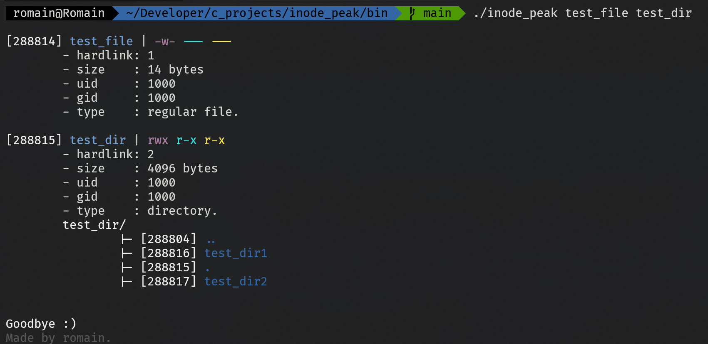

# inode_peak

`inode peak` is a small utility written in C that prints useful informations about files and directories in Linux. 

<p align="center">
    
    <br />
    <i align="center">Example of the program running.</i>
</p>

## Usage
The program takes filenames or directory names as arguments and prints out information about them. 
```bash
user@user:$ inode_peak file1 file2...
```

## Support 
The program supports multiple type of inodes: 
- 📄 Regular file.
- 🔗 Symbolic link.
- 📝 Char device.
- 🧱 Block device.
- 📁 Directory.


## Licence
- romainflcht